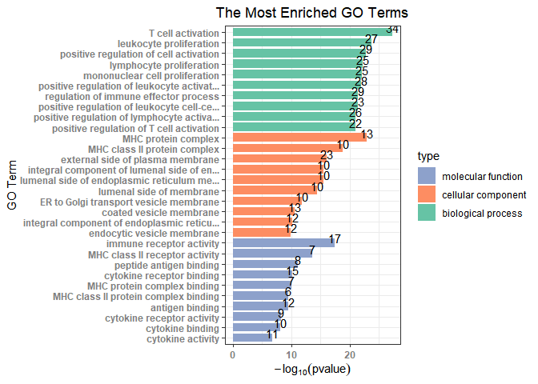

<!-- README.md is generated from README.Rmd. Please edit that file -->
# PSV2N

<!-- badges: start -->
<!-- badges: end -->
This is a shortest path-based algorithm named PS-V2N (Proximity Score of Vertex to Network) which was proposed for the target identification.

## Installation

You can install the released version of PSV2N from [CRAN](https://CRAN.R-project.org) with:

``` r
install.packages("devtools")
library(devtools)
github_install("windforclouds/PSV2N")
library(PSV2N)
```

## Example

This is a basic example which shows you how to solve a common problem:

``` r
library(PSV2N)
#> 
## basic example code
GOplot(vertex_sample[,1])
#> Loading required namespace: org.Hs.eg.db
#> 
#> Loading required package: org.Hs.eg.db
#> Loading required package: AnnotationDbi
#> Loading required package: stats4
#> Loading required package: BiocGenerics
#> Loading required package: parallel
#> 
#> Attaching package: 'BiocGenerics'
#> The following objects are masked from 'package:parallel':
#> 
#>     clusterApply, clusterApplyLB, clusterCall, clusterEvalQ,
#>     clusterExport, clusterMap, parApply, parCapply, parLapply,
#>     parLapplyLB, parRapply, parSapply, parSapplyLB
#> The following objects are masked from 'package:stats':
#> 
#>     IQR, mad, sd, var, xtabs
#> The following objects are masked from 'package:base':
#> 
#>     anyDuplicated, append, as.data.frame, basename, cbind, colnames,
#>     dirname, do.call, duplicated, eval, evalq, Filter, Find, get, grep,
#>     grepl, intersect, is.unsorted, lapply, Map, mapply, match, mget,
#>     order, paste, pmax, pmax.int, pmin, pmin.int, Position, rank,
#>     rbind, Reduce, rownames, sapply, setdiff, sort, table, tapply,
#>     union, unique, unsplit, which.max, which.min
#> Loading required package: Biobase
#> Welcome to Bioconductor
#> 
#>     Vignettes contain introductory material; view with
#>     'browseVignettes()'. To cite Bioconductor, see
#>     'citation("Biobase")', and for packages 'citation("pkgname")'.
#> Loading required package: IRanges
#> Loading required package: S4Vectors
#> 
#> Attaching package: 'S4Vectors'
#> The following object is masked from 'package:base':
#> 
#>     expand.grid
#> 
#> Attaching package: 'IRanges'
#> The following object is masked from 'package:grDevices':
#> 
#>     windows
#> 'select()' returned 1:1 mapping between keys and columns
#> [1] "GO Analysis Finished"
#> [1] "go_enrich_df finished"
```



What is special about using `README.Rmd` instead of just `README.md`? You can include R chunks like so:

``` r
summary(cars)
#>      speed           dist       
#>  Min.   : 4.0   Min.   :  2.00  
#>  1st Qu.:12.0   1st Qu.: 26.00  
#>  Median :15.0   Median : 36.00  
#>  Mean   :15.4   Mean   : 42.98  
#>  3rd Qu.:19.0   3rd Qu.: 56.00  
#>  Max.   :25.0   Max.   :120.00
```

You'll still need to render `README.Rmd` regularly, to keep `README.md` up-to-date. `devtools::build_readme()` is handy for this. You could also use GitHub Actions to re-render `README.Rmd` every time you push. An example workflow can be found here: <https://github.com/r-lib/actions/tree/master/examples>.

You can also embed plots, for example:


In that case, don't forget to commit and push the resulting figure files, so they display on GitHub and CRAN.
