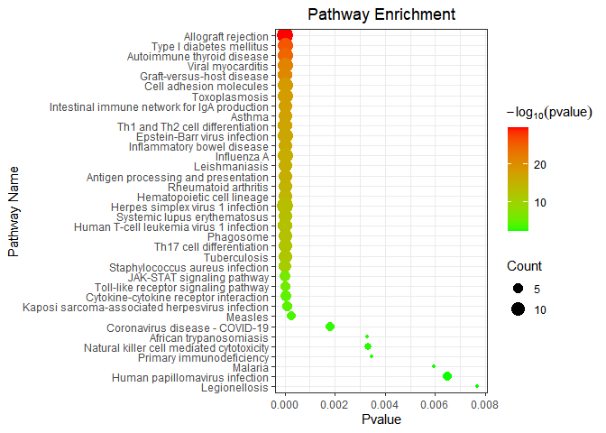

<!-- README.md is generated from README.Rmd. Please edit that file -->
# PSV2N

<!-- badges: start -->
<!-- badges: end -->
This is a shortest path-based algorithm named PS-V2N (Proximity Score of Vertex to Network) which was proposed for the target identification.

## Installation

You can install the released version of PSV2N from [github](https://github.com/windforclouds/PSV2N) with:

``` r
install.packages("devtools")
library(devtools)
github_install("windforclouds/PSV2N")
library(PSV2N)
```

## Example

GOplot

``` r
library(PSV2N)
## basic example code
GOplot(vertex_sample[,1])
#> [1] "GO Analysis Finished"
#> [1] "go_enrich_df finished"
```


KEGGplot

``` r
KEGGplot(
        vertex_sample[1:20,1],
        enrich.pvalue = 0.01,
        low.color = "green",
        high.color = "red",
        labs.x = "Pvalue",
        labs.y = "Pathway Name",
        titlesize.y   = 8,
        labs.title = "Pathway Enrichment"
        )
```



``` r
annotation_gene(vertex_sample[1:5,1])
#> Got the page successfully!   Written to the gene Written to the HGNC_ID  Written to the GeneType Written to the Summary  finished NO  1 
#> Got the page successfully!   Written to the gene Written to the HGNC_ID  Written to the GeneType Written to the Summary  finished NO  2 
#> Got the page successfully!   Written to the gene Written to the HGNC_ID  Written to the GeneType Written to the Summary  finished NO  3 
#> Got the page successfully!   Written to the gene Written to the HGNC_ID  Written to the GeneType Written to the Summary  finished NO  4 
#> Got the page successfully!   Written to the gene Written to the HGNC_ID  Written to the GeneType Written to the Summary  finished NO  5
#>     SYMBOL ENTREZID                               NCBI_url FullName HGNC_ID
#> 1  HLA-DRA     3122 https://www.ncbi.nlm.nih.gov/gene/3122  HLA-DRA    4947
#> 2 HLA-DRB1     3123 https://www.ncbi.nlm.nih.gov/gene/3123 HLA-DRB1    4948
#> 3 HLA-DQB1     3119 https://www.ncbi.nlm.nih.gov/gene/3119 HLA-DQB1    4944
#> 4 HLA-DQA1     3117 https://www.ncbi.nlm.nih.gov/gene/3117 HLA-DQA1    4942
#> 5  HLA-DMB     3109 https://www.ncbi.nlm.nih.gov/gene/3109  HLA-DMB    4935
#>         GeneType
#> 1 protein coding
#> 2 protein coding
#> 3 protein coding
#> 4 protein coding
#> 5 protein coding
#>                                                                                                                                                                                                                                                                                                                                                                                                                                                                                                                                                                                                                                                                                                                                                                                                                                                                                                                                                                                                                                           Summary
#> 1                                                                                                                                       HLA-DRA is one of the HLA class II alpha chain paralogues. This class II molecule is a heterodimer consisting of an alpha and a beta chain, both anchored in the membrane. This molecule is expressed on the surface of various antigen presenting cells such as B lymphocytes, dendritic cells, and monocytes/macrophages, and plays a central role in the immune system and response by presenting peptides derived from extracellular proteins, in particular, pathogen-derived peptides to T cells. The alpha chain is approximately 33-35 kDa and its gene contains 5 exons. Exon 1 encodes the leader peptide, exons 2 and 3 encode the two extracellular domains, and exon 4 encodes the transmembrane domain and the cytoplasmic tail. DRA does not have polymorphisms in the peptide binding part and acts as the sole alpha chain for DRB1, DRB3, DRB4 and DRB5. [provided by RefSeq, Aug 2020]
#> 2 HLA-DRB1 belongs to the HLA class II beta chain paralogs. The class II molecule is a heterodimer consisting of an alpha (DRA) and a beta chain (DRB), both anchored in the membrane. It plays a central role in the immune system by presenting peptides derived from extracellular proteins. Class II molecules are expressed in antigen presenting cells. The beta chain is approximately 26-28 kDa. It is encoded by 6 exons. Exon one encodes the leader peptide; exons 2 and 3 encode the two extracellular domains; exon 4 encodes the transmembrane domain; and exon 5 encodes the cytoplasmic tail. Within the DR molecule the beta chain contains all the polymorphisms specifying the peptide binding specificities. Hundreds of DRB1 alleles have been described and some alleles have increased frequencies associated with certain diseases or conditions. For example, DRB1*1302 has been related to acute and chronic hepatitis B virus persistence. There are multiple pseudogenes of this gene. [provided by RefSeq, Jul 2020]
#> 3                 HLA-DQB1 belongs to the HLA class II beta chain paralogs. This class II molecule is a heterodimer consisting of an alpha (DQA) and a beta chain (DQB), both anchored in the membrane. It plays a central role in the immune system by presenting peptides derived from extracellular proteins. Class II molecules are expressed in antigen presenting cells (APC: B lymphocytes, dendritic cells, macrophages). The beta chain is approximately 26-28 kDa and it contains six exons. Exon 1 encodes the leader peptide, exons 2 and 3 encode the two extracellular domains, exon 4 encodes the transmembrane domain and exon 5 encodes the cytoplasmic tail. Within the DQ molecule both the alpha chain and the beta chain contain the polymorphisms specifying the peptide binding specificities, resulting in up to four different molecules. Typing for these polymorphisms is routinely done for bone marrow transplantation. Alternative splicing results in multiple transcript variants. [provided by RefSeq, Sep 2011]
#> 4                                                                                       HLA-DQA1 belongs to the HLA class II alpha chain paralogues. The class II molecule is a heterodimer consisting of an alpha (DQA) and a beta chain (DQB), both anchored in the membrane. It plays a central role in the immune system by presenting peptides derived from extracellular proteins. Class II molecules are expressed in antigen presenting cells (APC: B Lymphocytes, dendritic cells, macrophages). The alpha chain is approximately 33-35 kDa. It is encoded by 5 exons; exon 1 encodes the leader peptide, exons 2 and 3 encode the two extracellular domains, and exon 4 encodes the transmembrane domain and the cytoplasmic tail. Within the DQ molecule both the alpha chain and the beta chain contain the polymorphisms specifying the peptide binding specificities, resulting in up to four different molecules. Typing for these polymorphisms is routinely done for bone marrow transplantation. [provided by RefSeq, Jul 2008]
#> 5                                                                                                                                                                                                                HLA-DMB belongs to the HLA class II beta chain paralogues. This class II molecule is a heterodimer consisting of an alpha (DMA) and a beta (DMB) chain, both anchored in the membrane. It is located in intracellular vesicles. DM plays a central role in the peptide loading of MHC class II molecules by helping to release the CLIP (class II-associated invariant chain peptide) molecule from the peptide binding site. Class II molecules are expressed in antigen presenting cells (APC: B lymphocytes, dendritic cells, macrophages). The beta chain is approximately 26-28 kDa and its gene contains 6 exons. Exon one encodes the leader peptide, exons 2 and 3 encode the two extracellular domains, exon 4 encodes the transmembrane domain and exon 5 encodes the cytoplasmic tail. [provided by RefSeq, Jul 2008]
```

You'll still need to render `README.Rmd` regularly, to keep `README.md` up-to-date. `devtools::build_readme()` is handy for this. You could also use GitHub Actions to re-render `README.Rmd` every time you push. An example workflow can be found here: <https://github.com/r-lib/actions/tree/master/examples>.

In that case, don't forget to commit and push the resulting figure files, so they display on GitHub and CRAN.
